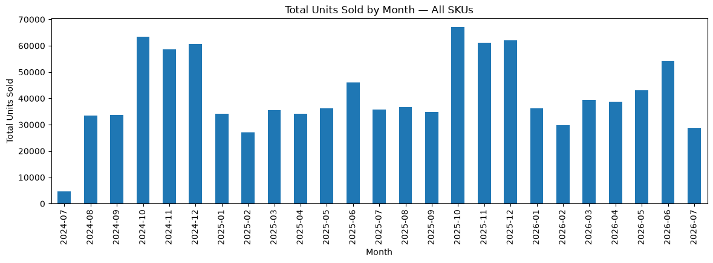
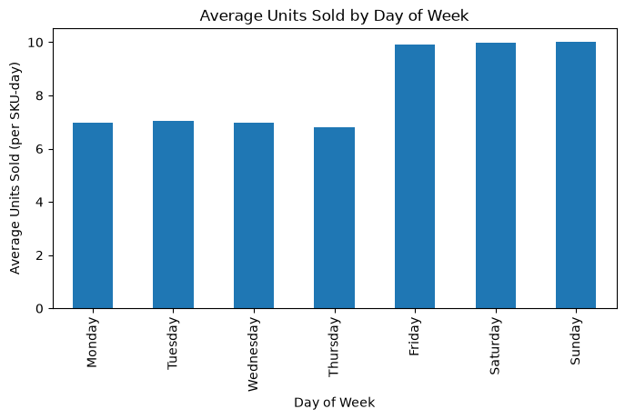
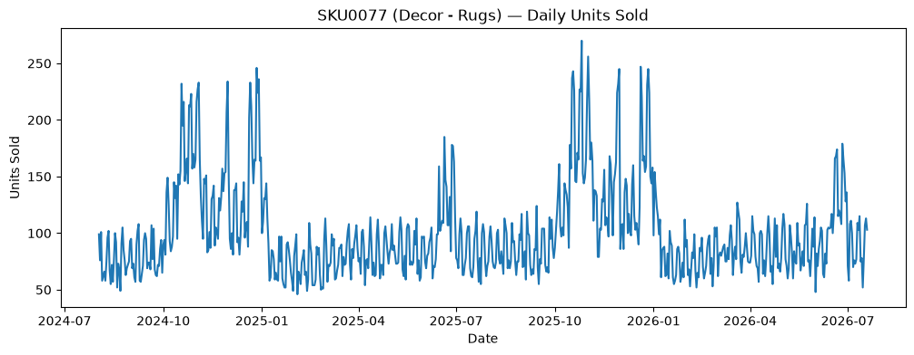

# EDA & Insight Memo — Project FORESIGHT

## 1. Data Quality Recap

The four raw extracts (sales_daily, sku_master, calendar, inventory_snapshots) were cleaned and merged into an analysis-ready dataset, as detailed in `data_quality_report.md`. Key issues included missing/duplicate/negative values in sales and inventory data, and inconsistent category labels in the SKU dimension — all handled and documented there.

## 2. Key Business Insights

### Insight 1: Total sales figures mislead for newly-launched SKUs

When I first ranked SKUs by total units sold, SKU0068 looked like dead stock, with only 13 units sold. This product is unpopular, nobody wants it — that was my first read. But then I checked its launch_date and found it only launched in May 2026, about 2 months before the data ends. It hasn't had enough time on sale to build up a big total yet.

This meant comparing its raw total to a SKU that's been selling for the full two years wasn't a fair comparison. To fix this, I calculated average units sold per day it's actually been on sale, instead of just the total — dividing total units sold by the number of days each SKU had been available. This is a fairer comparison because it treats a two-month-old product and a two-year-old product on equal footing, rather than punishing new arrivals for not having had time to rack up big numbers.

After this fix, SKU0068 still ranked near the bottom, confirming it genuinely sells poorly — but now for the right reason, backed by a fair comparison, not an accidental one caused by its recent launch date.

### Insight 2: Clear seasonal demand spikes around promotional periods

Looking at the monthly sales chart, two recurring patterns stand out. First, Oct-Dec of both years show a sustained lift, reaching 58,000-67,000 units — noticeably higher than the typical month's 30,000-40,000. This aligns with the promotional calendar, where Diwali Sale, Black Friday, and Year-End Sale all fall within this window. Second, a smaller bump appears each June (47,000-54,000 units), matching the Summer Sale period. The shortest bars, at the very start and end of the chart, aren't seasonal dips — they're simply partial months, since the data begins and ends mid-month.

### Insight 3: Weekend sales run significantly higher than weekdays

Looking at average daily sales by day of week, Monday through Thursday consistently sit around 7 units per SKU-day, while Friday through Sunday jump to about 10 units per SKU-day — a lift of roughly 40%. This pattern is remarkably consistent across the whole business, not just one or two products, suggesting customers browse and purchase home & lifestyle items more during their free time on weekends than on weekdays.

### Insight 4: Promotions genuinely lift sales, but the effect is entangled with seasonality

Comparing promo days to non-promo days shows an 87% lift in average units sold (13.4 vs. 7.2 units/SKU-day). However, this number should be read carefully: nearly all promotional events (Diwali Sale, Black Friday, Year-End Sale) fall within October-December, which is also the naturally highest-selling period of the year regardless of promotions. This means the 87% figure is likely a mix of two effects tangled together — genuine promotional lift, plus seasonal demand that would exist anyway. Isolating the "pure" promo effect from seasonality would need a more careful comparison (e.g., comparing promo vs. non-promo days within the same month), which is a natural next step beyond this initial analysis.

## 3. Supporting Investigation: SKU0077 Outlier Check

SKU0077 (a Décor rug) sold 72,332 units total — more than double the next best seller. Given how unusual that gap was, I checked its daily sales trend to rule out a data error before trusting the number. The chart shows consistent daily sales in a believable range (50-250 units/day) throughout the full two years, with no single impossible spike — and its peaks line up with the same promo windows identified in Insight 2. This confirms SKU0077 is a genuine, strong best-seller, not a data quality issue.

## 4. Limitations

- The 87% promo lift figure is confounded with seasonality and likely overstates the pure promotional effect, as explained above.
- Two months (Feb 2025, Feb 2026) show noticeably lower sales than other non-promo months; this pattern wasn't investigated further and could be worth a closer look.
- This analysis covers demand patterns only — it does not account for inventory position (stockouts limiting sales) or category-level differences in seasonality. These are addressed separately in the forecasting and risk-scoring work (see Section 5 below, and `risk_scored.csv`).

## 5. Forecast Horizon Assumptions

The 8-week demand forecast (used in risk scoring) is built recursively: each week's prediction feeds into the next week's lag features. Two assumptions from this approach are worth stating explicitly:

- **No future promotional calendar exists** in the provided data (`calendar.csv` ends on the same date as `sales_daily.csv`), so `promo_flag = 0` is assumed for all 8 forecast weeks. If NorthBay has known promotions planned in this window, demand for those weeks will be underestimated.
- **Recursive forecasts compound error over the horizon** — each week's prediction depends partly on the previous week's prediction rather than an observed value, so accuracy is expected to degrade somewhat by week 7-8 compared to week 1. This is an inherent limitation of the method, not a data issue.
- **SKU0077's forecast shows visible week-to-week oscillation.** This traces to the `baseline_forecast` feature (demand from the same week one year prior): SKU0077's year-ago comparison period was itself volatile, likely reflecting a similar promotional pattern to what's driving this year's spike. The model is faithfully reflecting genuine historical irregularity for this SKU, not malfunctioning — but it's worth knowing this SKU's forecast carries more week-to-week noise than a typical item.